# Supermarket Sales Python Analysis

## Problem
Analyze real supermarket sales data to identify top performing 
branches, most profitable categories, preferred payment methods,
and best selling months using Python.

## Dataset
- Source: Kaggle - Supermarket Sales Dataset
- 1,000 real sales records
- Period: 2021
- Columns: Branch, Category, Payment Type, Order Date, Price, Profit

## Tools Used
- Python (Pandas, Matplotlib)
- Kaggle Notebook

## Key Findings
- Total Profit: $5,001.61
- Best Branch: Austin-Texas with $2,209.36
- Best Category: Electronics with $1,712.73
- Most Used Payment: Cash with 57.3%
- Best Month: June with $642.29

## Decision & Recommendations
- Invest more in Austin-Texas as it is the top performer
- Focus on Electronics as it drives most profit
- Encourage Cash payments as they dominate transactions
- Plan promotions in June as it is the best month
- Review Sparks-Nevada branch strategy urgently

## Analysis Steps & Results

### Step 1: Load Data
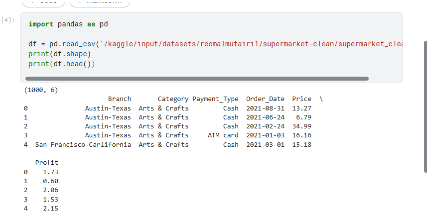

### Step 2: Total Profit by Branch
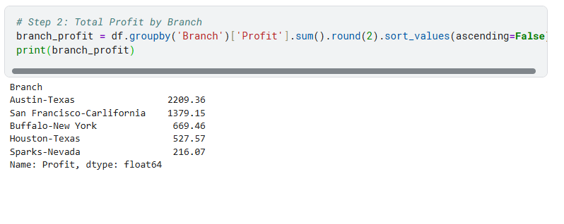

### Step 3: Total Profit by Category
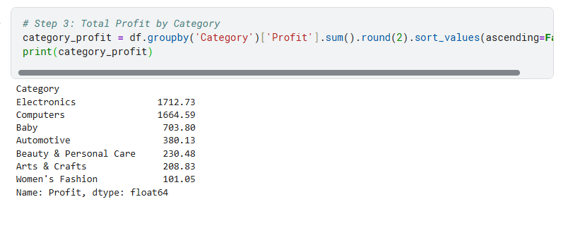

### Step 4: Total Profit by Payment Type
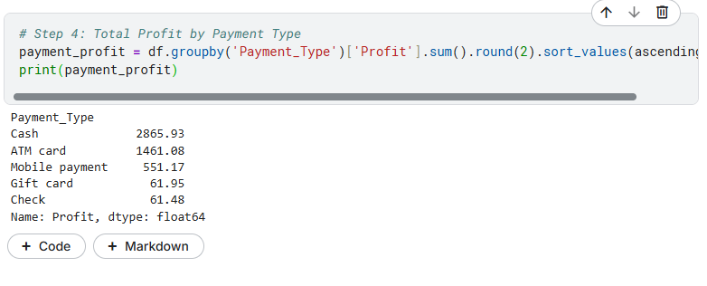

### Step 5: Total Profit by Month
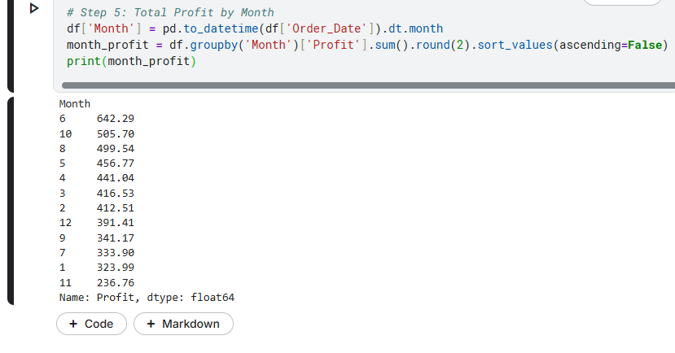

### Step 6: Bar Chart - Total Profit by Branch
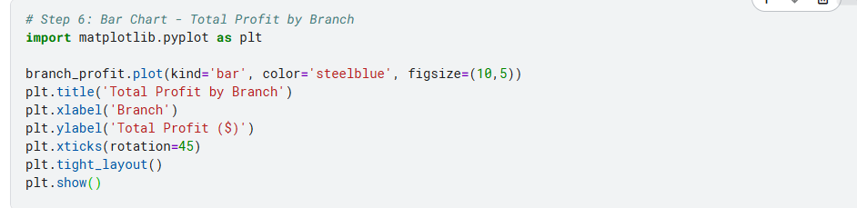
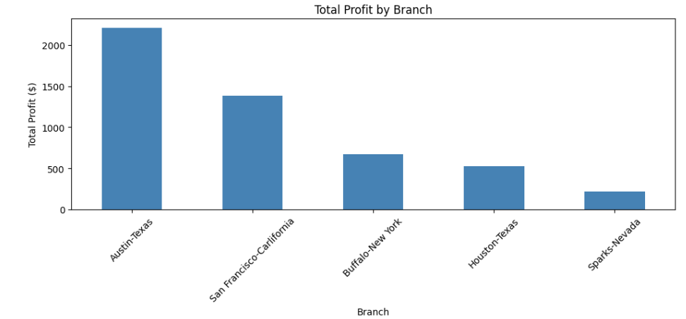

### Step 7: Bar Chart - Total Profit by Category
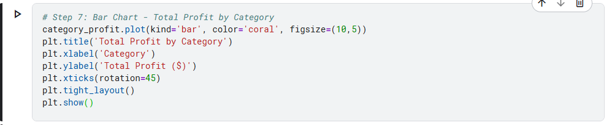
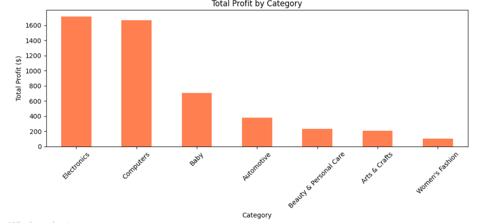

### Step 8: Pie Chart - Payment Type Distribution
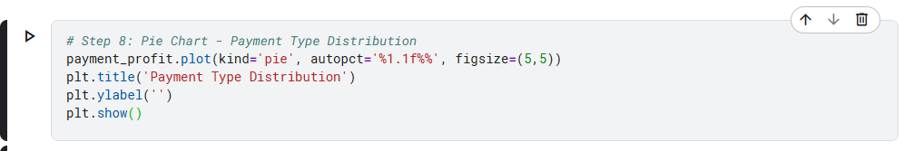
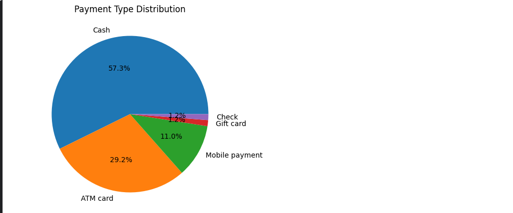

### Step 9: Line Chart - Total Profit by Month
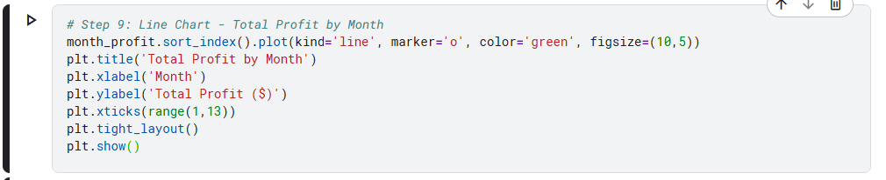
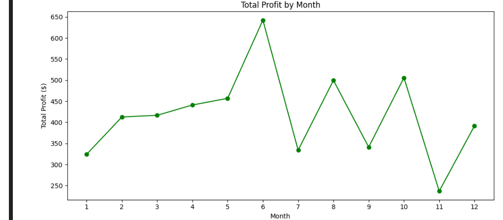

## Files
- notebook7e3ba9203e.ipynb : Python analysis notebook
